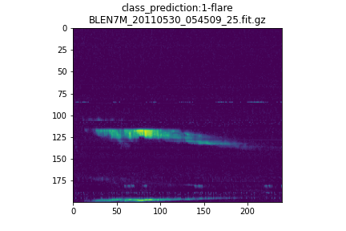
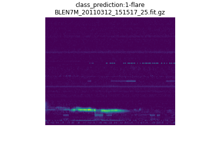

# ProjectSpectra: Solar Flares detection using CNNs
Detection of solar events in spectrograms from the <a href='http://www.e-callisto.org/'>e-callisto network</a>

 

The project makes use of Convolutional Neural Networks arquitectures implemented in pytorch, many of the designs were inspired by the papers: <a href='https://arxiv.org/abs/1912.10211'> PANNs: Large-Scale Pretrained Audio Neural Networks for Audio Pattern Recognition<a> and <a href="https://arxiv.org/abs/1609.09430">CNN Architectures for Large-Scale Audio Classification</a>, where CNNs have been proven successful on identifying different types of patterns inside spectrograms.
