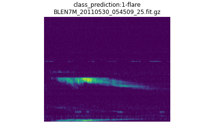

# ProjectSpectra: Solar Burst detection using Convolutional Neural Networks
Detection of solar events in spectrograms from the <a href='http://www.e-callisto.org/'>e-callisto network</a>

 

This project makes use of CNNs arquitectures implemented in pytorch, many of which were inspired by: <a href='https://arxiv.org/abs/1912.10211'> PANNs: Large-Scale Pretrained Audio Neural Networks for Audio Pattern Recognition<a> and <a href="https://arxiv.org/abs/1609.09430">CNN Architectures for Large-Scale Audio Classification</a>, where CNNs have been proven successful on identifying many different types of patterns in spectrograms.
